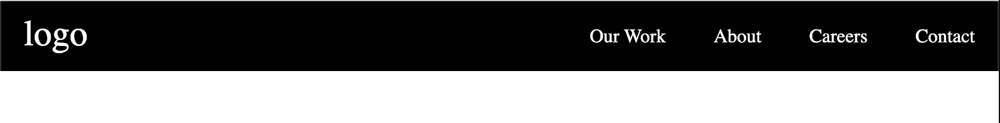

# Documentation 🔖

## Introduction 🔡
React-simple-navbar is a ready-made responsive and customizable navbar that beginners and experts can use in their react projects.

## Install the package 📦

```console
npm install react-simple-navbar
```

## Import the package from the node module folder 📂

node_modules > react-simple-navbar > src > lib > components > styles > index.css 👇🏽

```Javascript
import '../node_modules/react-simple-navbar/src/lib/components/styles/index.css'
function App() {
  return (
    <div className="App">

    </div>
  );
}

export default App;
```
## The Tags
###  Nav tag
###  Logo tag
###  Input tag
###  Label Tag
###  Cite tag
###  Ul tag
###  Li tag


```Javascript
import '../node_modules/react-simple-navbar/src/lib/components/styles/index.css'
function App() {
  return (
    <div className="App">
       <nav>
        <logo>logo</logo>
        <input type="checkbox" id="menu-btn" />
        <label for="menu-btn">
          <cite></cite>
        </label>
        <ul>
          <li>Home</li>
          <li>About</li>
          <li>School</li>
          <li>Contact</li>
        </ul>
      </nav>
    </div>
  );
}

export default App;
```
### With the code above and you're good to go. 👆

## Result 
### Desktop default View 👇🏽


### Mobile default View 👇🏽


## How to edit background color and color(font color)
To edit the  **background color** and **color** add the code below 👇🏽 into the nav tag.

```Javascript
<nav style={{backgroundColor:"brown", color:"green"}}></nav>
```

You should get something like this 👇🏽


## For Logo 🔷
To use logo, add an image or text in between the logo tag.

```Javascript
<logo></logo>
```
You can reduce or increase the width and height of the logo 👇🏽
```Javascript
<logo style={{width:"50px", height:"50px"}}></logo>
```

## The Label Tag 🏷️
The Label tag is body for the harmburger icon(the collapse button). You can edit the **background color** of the icon. 👇🏽
```Javascript
<label style{{backgroundColor:"White"}}></label>
```

## The Cite Tag
This is the harmburger icon itself don't temper with it.

## The Li Tag 📒
This is the tag for the text link(Home, About, School etc). You can edit it by adding the follow code below in the Li tag. 👇🏽

| Attribute   |     Code    
|----------|:-------------:
| Font Color   | style={{color:"pink"}}
| Font Size| style={{fontSize:"20px"}}
| Font Family|   style={{fontFamily:"sans-serif"}}
| Font Weight| style={{fontWeight:'bold'}}
| Text Align | style={{textAlign:"center"}}
| Font BackgroundColor|  style={{backgroundColor:"greenyellow"}}

## Miscellaneous 📝
You can also edit to your choice of color, size, width, etc by using the style code inside the respective tag. 

## About 👥
This project is developed by me, Sam Abdul And my friend Tega. You can give us credit by follow us on Twitter [@SamAbdul_](https://twitter.com/SamAbdul_) and [@Teggyg_](https://twitter.com/Teggyg_). If you have any question you can message us on Twitter. Thank you🇳🇬.
